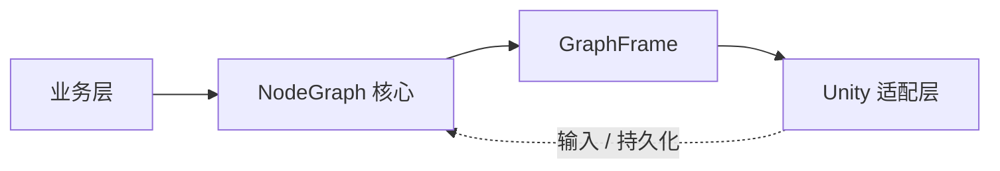
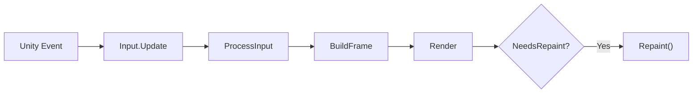

# com.zgx197.nodegraph

<div align="center">
  <h1>NodeGraph</h1>
  <p><strong>面向 Unity 的轻量、引擎无关节点图框架</strong></p>
  <p>Graph / Node / Port / Edge 数据模型 · Undo/Redo 命令系统 · SubGraph · JSON 序列化 · GraphFrame 渲染描述</p>
  <p>
    
    
    
    
    
    
  </p>
</div>

---

| 维度 | 说明 |
| --- | --- |
| 核心定位 | 一套可复用的节点图底座，关注“编辑器如何建图、视图如何表达、业务如何扩展” |
| 架构特征 | 纯 C# 核心输出 `GraphFrame`，Unity 侧负责输入适配、渲染和持久化 |
| 主要能力 | 节点/端口/连线建模、命令系统、自动布局、搜索、小地图、分组、注释、SubGraph、条件描述 |
| 适用场景 | 刷怪蓝图、技能编辑器、行为树、状态机、对话树，以及其他项目级图编辑工具 |
| 当前形态 | Unity UPM 包；核心程序集支持 `noEngineReferences`，编辑器适配层按需引用 |

## 🏗️ 架构总览

### 1. 总体架构



这张图聚焦最核心的结构关系：业务层定义图语义，NodeGraph 负责图编辑核心，Unity 侧负责输入、渲染和持久化，二者之间通过 `GraphFrame` 连接。

### 2. Unity 宿主流程



这张图对应宿主窗口里的主循环，也就是 README 后面 `EditorWindow` 示例那条典型调用链。

> 如果你是第一次进入这个仓库，建议先读完“快速导航”“功能亮点”和“如何理解这个库”三部分，再进入设计文档。

<a id="quick-nav"></a>
## 🧭 快速导航

- [这是什么](#what-is-nodegraph)
- [功能亮点](#feature-highlights)
- [运行环境](#runtime-environment)
- [安装](#installation)
- [程序集组成](#assemblies)
- [接入示例](#integration-examples)
- [如何理解这个库](#how-it-works)
- [Quick Start](#quick-start)
- [阅读建议](#reading-guide)
- [相关文档](#documents)

<a id="what-is-nodegraph"></a>
## 📌 这是什么

NodeGraph 是一个面向 Unity 的通用节点图框架。它不直接绑定某一种业务，而是把节点图编辑器常见的共性能力抽成可复用的基础设施：

- `Core` 负责图数据模型、连接规则、图算法和扩展点。
- `Commands` 负责 Undo/Redo 与结构变更命令。
- `View` 负责 `GraphViewModel`、交互处理、`GraphFrame` 构建和主题配置。
- `Layout` 提供树形、分层、力导向布局算法。
- `Serialization` 提供 JSON 序列化与恢复。
- `Editor` 提供 Unity Editor 输入、渲染和持久化适配。

它更像一个“节点图 SDK”，而不是单一业务编辑器。

<a id="feature-highlights"></a>
## ✨ 功能亮点

| 能力 | 说明 |
| --- | --- |
| 可复用图模型 | `Graph`、`Node`、`Port`、`Edge`、`GraphSettings` 构成核心数据模型，支持 DAG / 有向图 / 无向图策略 |
| 命令式编辑 | 内置 `CommandHistory`、复合命令和多种结构命令，适合编辑器集成 Undo/Redo |
| GraphFrame 架构 | 纯 C# 层不直接绘图，而是输出 `GraphFrame`，渲染层只消费渲染描述 |
| 多蓝图扩展 | 通过 `BlueprintProfile`、`IGraphFrameBuilder`、`NodeVisualTheme` 适配不同行为和视觉风格 |
| 交互基础设施 | 节点拖拽、连线拖拽、框选、平移缩放、快捷键、上下文菜单入口都已具备 |
| 高级编辑能力 | Search、小地图、分组、注释、SubGraph、Multiple 端口槽位、节点显示模式 |
| 布局与序列化 | Tree / Layered / ForceDirected 布局算法，JSON 序列化与 Unity 持久化 |
| 业务扩展点 | `INodeTypeCatalog`、`IConnectionPolicy`、`INodeContentRenderer`、`IEdgeLabelRenderer`、`ITextMeasurer` 等 |

> 这套框架最适合“我想做一个自己的图编辑器，但不想从 Graph 数据结构、撤销重做、交互细节和渲染抽象重新造轮子”的场景。

<a id="runtime-environment"></a>
## 🧪 运行环境

- Unity 2021.3+
- .NET Standard 2.1
- 推荐以 UPM 本地包或 Git URL 的方式接入

<a id="installation"></a>
## 📦 安装

在宿主 Unity 工程的 `Packages/manifest.json` 中添加依赖。

### 开发阶段：本地路径

```json
{
  "dependencies": {
    "com.zgx197.nodegraph": "file:../../com.zgx197.nodegraph"
  }
}
```

### 版本接入：Git URL + tag

```json
{
  "dependencies": {
    "com.zgx197.nodegraph": "https://github.com/zgx197/com.zgx197.nodegraph.git#v0.1.0"
  }
}
```

### asmdef 引用说明

本包所有程序集都设置为 `autoReferenced: false`。  
这意味着消费者需要在自己的 `.asmdef` 里显式声明所需引用，而不是安装后自动可见。

<a id="assemblies"></a>
## 🧩 程序集组成

| 程序集 | 内容 | `noEngineReferences` |
| --- | --- | --- |
| `com.zgx197.nodegraph.math` | `Vec2`、`Rect2`、`Color4`、`BezierMath` | `true` |
| `com.zgx197.nodegraph.core` | `Graph`、`Node`、`Port`、`Edge`、`GraphSettings` | `true` |
| `com.zgx197.nodegraph.abstraction` | `IEditContext`、`IPlatformInput`、`ITextMeasurer`、内容渲染相关接口 | `true` |
| `com.zgx197.nodegraph.commands` | `ICommand`、`CommandHistory`、内置结构命令 | `true` |
| `com.zgx197.nodegraph.layout` | `ForceDirected`、`Layered`、`Tree` 布局算法 | `true` |
| `com.zgx197.nodegraph.serialization` | `JsonGraphSerializer`、持久化辅助层 | `true` |
| `com.zgx197.nodegraph.view` | `GraphViewModel`、`GraphRenderConfig`、`BlueprintProfile`、主题与 FrameBuilder | `true` |
| `com.zgx197.nodegraph.editor` | `UnityGraphRenderer`、`UnityPlatformInput`、Unity 持久化适配 | `false` |

<a id="integration-examples"></a>
## 🛠️ 接入示例

下面这部分是面向接入方的实用模板，不追求“复制即跑”，但尽量贴近当前 API 形态。

### `.asmdef` 引用示例

如果你在业务运行时代码里只使用图数据、命令和序列化，大概率会是这样的引用组合：

```json
{
  "name": "MyGame.GraphRuntime",
  "rootNamespace": "MyGame.GraphRuntime",
  "references": [
    "com.zgx197.nodegraph.math",
    "com.zgx197.nodegraph.core",
    "com.zgx197.nodegraph.abstraction",
    "com.zgx197.nodegraph.commands",
    "com.zgx197.nodegraph.layout",
    "com.zgx197.nodegraph.serialization",
    "com.zgx197.nodegraph.view"
  ],
  "includePlatforms": [],
  "excludePlatforms": [],
  "allowUnsafeCode": false,
  "overrideReferences": false,
  "precompiledReferences": [],
  "autoReferenced": true,
  "defineConstraints": [],
  "versionDefines": [],
  "noEngineReferences": false
}
```

如果你要在 Unity Editor 里承载图窗口、输入和渲染，则通常还需要单独一个编辑器程序集：

```json
{
  "name": "MyGame.GraphEditor",
  "rootNamespace": "MyGame.GraphEditor",
  "references": [
    "MyGame.GraphRuntime",
    "com.zgx197.nodegraph.math",
    "com.zgx197.nodegraph.core",
    "com.zgx197.nodegraph.abstraction",
    "com.zgx197.nodegraph.commands",
    "com.zgx197.nodegraph.view",
    "com.zgx197.nodegraph.editor"
  ],
  "includePlatforms": [
    "Editor"
  ],
  "excludePlatforms": [],
  "allowUnsafeCode": false,
  "overrideReferences": false,
  "precompiledReferences": [],
  "autoReferenced": true,
  "defineConstraints": [],
  "versionDefines": [],
  "noEngineReferences": false
}
```

一个简单的判断方式：

- 只做图数据、命令、布局、序列化处理：先引 `math/core/abstraction/commands/layout/serialization/view`
- 要做 Unity 编辑器窗口：再加上 `com.zgx197.nodegraph.editor`
- 如果你只消费自己的业务封装层，可以把这些依赖都收敛到自己的 runtime/editor 两个程序集里

### Unity Editor host 示例

下面这个例子展示一个最小的宿主窗口骨架，重点是把 `GraphViewModel`、`UnityPlatformInput`、`UnityGraphRenderer` 和 `BlueprintProfile` 串起来：

```csharp
using UnityEditor;
using UnityEngine;
using NodeGraph.Core;
using NodeGraph.Unity;
using NodeGraph.View;

public class MyNodeGraphWindow : EditorWindow
{
    private Graph _graph = null!;
    private BlueprintProfile _profile = null!;
    private GraphRenderConfig _renderConfig = null!;
    private GraphViewModel _viewModel = null!;

    private UnityPlatformInput _input = null!;
    private UnityEditContext _editContext = null!;
    private UnityGraphRenderer _renderer = null!;
    private CanvasCoordinateHelper _coordinateHelper = null!;

    [MenuItem("Tools/My Game/Node Graph")]
    private static void Open()
    {
        GetWindow<MyNodeGraphWindow>("Node Graph");
    }

    private void OnEnable()
    {
        wantsMouseMove = true;

        var nodeTypes = MyNodeTypeCatalog.CreateDefault();
        var textMeasurer = new UnityTextMeasurer();
        var frameBuilder = new DefaultFrameBuilder(textMeasurer);

        _graph = new Graph(new GraphSettings
        {
            Topology = GraphTopologyPolicy.DAG,
            NodeTypes = nodeTypes
        });

        _profile = new BlueprintProfile
        {
            Name = "My Graph",
            NodeTypes = nodeTypes,
            FrameBuilder = frameBuilder,
            Theme = NodeVisualTheme.Dark
        };

        _renderConfig = _profile.BuildRenderConfig();

        _viewModel = new GraphViewModel(_graph, _renderConfig)
        {
            NodeTypeCatalog = _profile.NodeTypes
        };

        _input = new UnityPlatformInput();
        _editContext = new UnityEditContext();
        _renderer = new UnityGraphRenderer(
            _renderConfig.ContentRenderers,
            _renderConfig.EdgeLabelRenderer);
        _coordinateHelper = new CanvasCoordinateHelper();
    }

    private void OnGUI()
    {
        var graphRect = new Rect(0f, 0f, position.width, position.height);

        _coordinateHelper.SetGraphAreaRect(graphRect);
        _input.Update(Event.current, _coordinateHelper);

        var eventType = Event.current.type;

        if (eventType != EventType.Layout && eventType != EventType.Repaint)
        {
            _viewModel.PreUpdateNodeSizes();
            _viewModel.ProcessInput(_input);
        }

        if (eventType == EventType.Repaint)
        {
            _viewModel.Update(0f);
            var frame = _viewModel.BuildFrame(graphRect.ToNodeGraph());
            _renderer.Render(frame, _profile.Theme, graphRect, _editContext, graphRect.position);
        }

        if (_viewModel.NeedsRepaint)
            Repaint();
    }
}
```

这个窗口骨架里最重要的几件事是：

- `DefaultFrameBuilder` 需要一个 `ITextMeasurer`，Unity 下可直接用 `UnityTextMeasurer`
- `GraphViewModel` 持有编辑状态和命令历史，宿主窗口只负责驱动
- 输入事件和绘制事件最好分开处理，避免每次 `OnGUI` 都跑完整流程
- `CanvasCoordinateHelper` 用来修正画布区域内的鼠标坐标
- `UnityGraphRenderer` 直接消费 `GraphFrame`，不需要业务层自己手写节点绘图

<a id="how-it-works"></a>
## 🧠 如何理解这个库

理解 NodeGraph，最简单的方式是把它看成三层：

1. 业务层：定义你的节点类型、业务数据、内容渲染器和连接规则。
2. 框架层：维护图数据、命令、选择、交互状态，并构建 `GraphFrame`。
3. 引擎适配层：把 Unity 事件转成平台输入，把 `GraphFrame` 渲染成真正的界面。

### 一条主链路
见上方“总体架构”图。

### 宿主窗口的典型驱动方式
见上方“Unity 宿主流程”图。

这套设计的核心价值是：框架层不依赖 Unity 绘图 API，但又能让 Unity 适配层充分利用原生绘制能力。

<a id="quick-start"></a>
## Quick Start

下面这段示例不是“完整可运行编辑器”，而是最小接入思路：先准备图、节点类型目录和渲染配置，再由宿主窗口驱动 `GraphViewModel`。

```csharp
using NodeGraph.Commands;
using NodeGraph.Core;
using NodeGraph.Math;
using NodeGraph.View;

// 1. 业务层提供自己的节点类型目录实现
INodeTypeCatalog nodeTypes = MyNodeTypeCatalog.CreateDefault();

// 2. 创建图配置
var settings = new GraphSettings
{
    Topology = GraphTopologyPolicy.DAG,
    NodeTypes = nodeTypes
};

// 3. 创建图
var graph = new Graph(settings);

// 4. 准备蓝图配置（FrameBuilder / Theme / Renderers 由宿主决定）
var profile = new BlueprintProfile
{
    Name = "Default",
    NodeTypes = nodeTypes,
    FrameBuilder = myFrameBuilder,
    Theme = NodeVisualTheme.Dark
};

// 5. 创建视图模型
var viewModel = new GraphViewModel(graph, profile.BuildRenderConfig())
{
    NodeTypeCatalog = profile.NodeTypes
};

// 6. 通过命令系统编辑图
viewModel.Commands.Execute(new AddNodeCommand("SpawnTask", new Vec2(100, 100)));
viewModel.Commands.Undo();
```

如果你接的是 Unity 编辑器宿主，通常还会额外准备这些对象：

- `ITextMeasurer`：供 `FrameBuilder` 计算节点尺寸
- `UnityPlatformInput`：将 Unity `Event` 转成框架输入
- `UnityGraphRenderer`：消费 `GraphFrame` 完成绘制
- `IEditContext`：供节点内嵌编辑器使用

<a id="reading-guide"></a>
## 📚 阅读建议

| 你现在最关心什么 | 建议先看 |
| --- | --- |
| 我想快速知道这个库解决什么问题 | 本 README 的“这是什么”“功能亮点” |
| 我想知道项目由哪些模块构成 | 本 README 的“程序集组成” |
| 我想理解整体架构 | [Documents/NodeGraph设计文档.md](Documents/NodeGraph设计文档.md) |
| 我想看包化取舍和 API 收口思路 | [Documents/NodeGraph Package化规划.md](Documents/NodeGraph%20Package化规划.md) |
| 我想了解已有测试入口 | [Documents/测试指南.md](Documents/测试指南.md) |

<a id="documents"></a>
## 📎 相关文档

- [设计文档](Documents/NodeGraph设计文档.md)
- [Package 化规划](Documents/NodeGraph%20Package化规划.md)
- [测试指南](Documents/测试指南.md)
- [更新日志](CHANGELOG.md)

## ⚖️ License

MIT. See [LICENSE](LICENSE).
